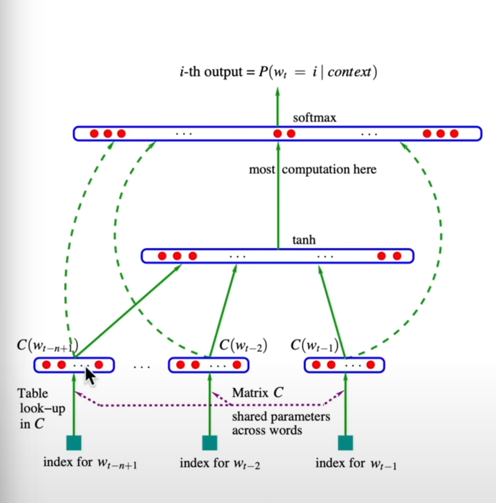

# MLP

steps in this:
1. There is this embedding space which contain 17000 in 30 multi dimensional space that is called embedding space. Each similar word that have pretty similar function semantic will place very close to each other in the space.
2. Here we use the same dataset that is names.txt
3. we define named block size that is a block of character  (in thi example is 3 character) that is used to predict the next character
4. in the (1) it said that we want to make 17000 fit in 30 dimensional space, for an example we will use 2 dimensional space (27, 2) <- example.
5. 
6. In image  (5), the table look-up in C is the same as get the index with using of slicing specific index with onehot embedding with specific number
7. indexing in pytorch is quite powerfull because its ability to not only normal indexing, but also can input a list of index to get more than one index value, and also input a tensor to get index with ability to repeat the index value
   1. why input of torch size for C = torch.Size([27, 2]) and X= torch.Size([228146, 3] # resulted in torch.Size([228146, 3, 2])  when using C[X]? -> its because the use of indexing C and use X as index, then it see the number of rows tahts is 228146 and each rows have 3 values, then it will take the value of C which have 27 rows. Then it take the 2 values and it  created new tensor with torch.Size([228146, 3, 2])
8. some of the useful tensor function is a.view -> which will create a matrix and architect the matrix, for example tensor (9,2) (total 18) -> view(3, 3, 2) (total 18) -> this is the same as concatentate tensor with torch.cat() function using 1 dimension
9. information about pytorch internal: http://blog.ezyang.com/2019/05/pytorch-internals/
10. cross entropy to get the clasificcation, its the same as using the way to calculate logits in the makemore part -> cross entropy is more efficient 
11. 